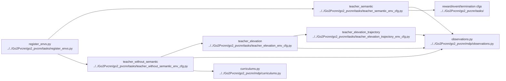

# AI Environment And Observations

## Navigation

- doc role: AI stage note
- paired human doc: [../human/human-03-environment-and-observations.md](../human/human-03-environment-and-observations.md)
- previous: [ai-02-training-and-entrypoints.md](ai-02-training-and-entrypoints.md)
- next: [ai-04-lidar-and-pvcnn.md](ai-04-lidar-and-pvcnn.md)
- master index: [../index.md](../index.md)

## Purpose

Track where task configs, scene configs, observations, rewards, and curriculum are defined and how they feed later stages.

## Code Graph

## Candidate Files

- `Go2Pvcnn/go2_pvcnn/tasks/`
- `Go2Pvcnn/go2_pvcnn/mdp/curriculums.py`

## Inputs

- selected env cfg
- robot and terrain config
- sensor config

## Outputs

- policy observations
- critic observations
- curriculum state

## M1 AME contract (2026-09-17)

Separate reference-controller scope(2026-09-18): [tools/m1_reference_validation](../../tools/m1_reference_validation),formal646f486,uses readonlyreferenceconfiguration/wrapper/assets,zero policyresidualandexplicitcontroller_oracle. It calls originalprepare/IK, preserves allcrossing actions, then a verifiedpost-cross-only boundedwheelcontroller replacesonlywheelcolumns12:16afterorderedFAR/RARtouchdown,phase11andfivequalifiedsamples. Threeindependent8×1600runs passstrict8/8/native0;formal373CPU/spec/qualitypass. Normalcloning/ownerreleasebeforeappclose isverifiedforthisreferencepath,notyetAMEtraining. NoAMEobs/reward/actioncontractchangedbythispromotion. Itsfixedbarhas~45mmexposedheightandisnarrow/right-wheelonly;thisisnotpolicy-only/fullwidth100mmcrossingorlargeavoidance.1024layout/budgetworkisstillisolatedandunverifiedphysically. See[repeat3](../log/2026-09-18-m1-sync-repeat16.md),[promotion](../log/2026-09-18-m1-sync-promotion-verification.md),[scaleaudit](../log/2026-09-18-m1-1024-readiness-audit.md).

2026-09-18 approved reward update: M1 airtime/airtime-variance terms are disabled. `small_obstacle_progress`(1.0) uses signed actual LINK motion along the yaw-rotated command; `small_obstacle_climb`(0.5) couples forward root/wheel motion with upward wheel motion after subtracting full root rigid motion. Semantic1/finite-valid local-map gates and semantic2 env veto restrict these terms; all existing collision/termination rules remain. Shared scanner conversion now rejects nonfinite source samples even if an explicit valid bit is true. Shapes/algorithms are unchanged. See[contract and verification](../log/2026-09-18-m1-wheel-reward-implementation.md).

M1 uses [m1_ame_env_cfg.py](../../Go2Pvcnn/ame_baseline/m1_ame_env_cfg.py), a training-only floating-root spawn conversion and [mixed actions](../../Go2Pvcnn/ame_baseline/m1_ame_actions.py): 12 leg position targets plus four wheel velocity targets in the explicit 16-joint asset order. Policy state excludes wheel joint state and wheel action history; flattened policy/critic widths are 1581/1584. Old 1585/1588 checkpoints cannot be resumed under this contract. Continuous wheel angles remain finite-checked but are not limited by the leg-angle runaway guard. Reward geometry uses the M1 backend, and wheel slip is contact-point tangential speed rather than generic foot velocity. See [T306](../todo/T306-m1-ame-long-train-stability.md) for verified scope and remaining behavior gates.

M1 fixed-seed behavior evaluation retains first-episode outcomes across auto-reset. `goal_reached_rate` means ever reached; safe success additionally excludes collision, invalid state and any non-timeout failure from `termination_manager.terminated`, including a fall after reaching the goal. Pure timeouts do not erase prior success; simultaneous failure+timeout still fails. See [metric correction](../log/2026-09-17-m1-evaluation-terminal-failure.md). Diagnostic root progress/wheel lift is not equivalent to full crossing: the controlled probe separately reports all four final wheel centers beyond the obstacle rear edge plus wheel radius, and resets must be zero. See [matched-height evidence](../log/2026-09-17-m1-step-height-matched-probe.md).

The bounded600-step probe now explicitly uses8m env spacing, matching evaluation. Its scanner merges registered meshes globally, unlike PhysX's cross-environment collision filtering; the previous2.5m probe spacing scanned neighboring boxes after the intended crossing. The8m A/B removes the72 residual geometry events without changing any training collision/reward semantics. This spacing is validated for this bounded path, not a general guarantee for unbounded travel. See [event trace and isolation fix](../log/2026-09-18-m1-probe-neighbor-contamination-fix.md).
