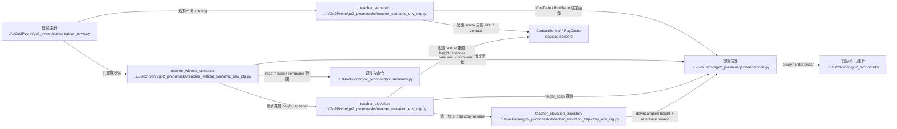

# Human Environment And Observations

## 导航

- 文档类型：`human` 阶段文档
- 对应 AI 文档：[../ai/ai-03-environment-and-observations.md](../ai/ai-03-environment-and-observations.md)
- 上一篇：[human-02-training-and-entrypoints.md](human-02-training-and-entrypoints.md)
- 下一篇：[human-04-lidar-and-pvcnn.md](human-04-lidar-and-pvcnn.md)
- 总索引：[../index.md](../index.md)

## 作用

说明任务配置、场景、奖励、观测和 curriculum 是怎么拼起来的。

## Mermaid 代码结构图

## 重点目录

- [tasks](../../Go2Pvcnn/go2_pvcnn/tasks)
- [curriculums.py](../../Go2Pvcnn/go2_pvcnn/mdp/curriculums.py)

## 上游输入

- 入口脚本选择的 env cfg
- 机器人模型、地形、传感器配置

## 下游消费者

- LiDAR / ray caster
- PVCNN 特征抽取
- PPO runner 的观测输入

## M1 AME 当前训练接口（2026-09-17）

2026-09-18新增的是独立[参考控制器验证入口](../../tools/m1_reference_validation)，正式版本646f486；没有把它混进下述AME策略。零策略残差经过原逐轮跨越/IK，只有右前FAR和右后RAR跨越落地、phase11及连续5个稳定样本后，才接管4列轮速做有界平地同步。相同版本三次8环境×1600步均8/8严格通过并正常退出，正式373项CPU与两轮审查通过。这证明固定窄横杆（露出约45mm）的controller-assisted重复性，不证明策略自主学会100mm全宽跨越、大绕行或10000轮训练。1024仍在隔离扩容准备；参考入口的正常关闭也尚未推广到AME训练入口。见[第三次实测](../log/2026-09-18-m1-sync-repeat16.md)、[正式接入](../log/2026-09-18-m1-sync-promotion-verification.md)。

2026-09-18用户确认后，M1旧腾空/腾空时长方差奖励已替换为`small_obstacle_progress`（1.0）和`small_obstacle_climb`（0.5）：实际前进才获得进度，抬轮必须同时前进并扣除机身升降/俯仰/横滚造成的轮心运动。semantic1有效局部区域才启用，附近semantic2会否决新奖励；停止、空转、原地抬腿不给这些新增正奖励。原碰撞和失败终止规则保留，NaN/Inf不能因为valid标志为真而成为有效地图。维度和算法不变；CPU通过不代表已学会跨越，见[实施验证](../log/2026-09-18-m1-wheel-reward-implementation.md)。

M1 使用独立的 [M1 配置](../../Go2Pvcnn/ame_baseline/m1_ame_env_cfg.py)，不修改源 USD 或 Go2 配置。训练时解除固定底座并迁移 articulation-root API；16 维 action 按名字分为 12 个腿位置控制和 4 个连续轮速控制。policy 不读取轮子角度、轮速或轮子 action history，展开观测宽度为 policy 1581 / critic 1584，旧 1585/1588 checkpoint 不能直接续训。

姿态与关节限位只约束腿关节；正常滚轮转动使用接触点切向速度判断打滑，不再被当作普通脚滑动。当前通过的是平地驱动和 AME/AMP 短训练；10000 单进程稳定性和真实小障碍跨越/大障碍绕行仍需验证。过程与证据见 [T306](../todo/T306-m1-ame-long-train-stability.md)。

固定场景评测只统计第一次 episode，避免自动reset后的新状态污染结果。“曾到达终点”与“安全成功”分开：到达后翻倒、触发机身接触终止等仍算失败；正常超时本身不抹去已有成功，失败与超时同一步出现则仍失败。见 [评测修正](../log/2026-09-17-m1-evaluation-terminal-failure.md)。物理探测也将“root前进/某轮抬高”与“四轮全过”分开，后者要求四轮轮心都越过障碍后沿加轮半径且没有reset；0.05m接触探测不能当作0.10m完整越障证明。见 [高度匹配探测](../log/2026-09-17-m1-step-height-matched-probe.md)。

600步有界物理probe现与评测统一为8m环境间距。scanner会合并所有登记的障碍网格，但PhysX会过滤不同环境之间的碰撞；原2.5m间距导致通过自身障碍后扫到邻居障碍。8m对照消除了72次残余几何事件，没有放宽训练碰撞惩罚。该隔离距离只对当前有界路径验证有效，不能推广为无限距离移动的隔离保证。见 [逐事件追踪与隔离修复](../log/2026-09-18-m1-probe-neighbor-contamination-fix.md)。

## 待补充

- policy / critic 观测各自包含什么
- curriculum 在哪些 env cfg 中启用
- PLAY 和训练版配置的真实差异
